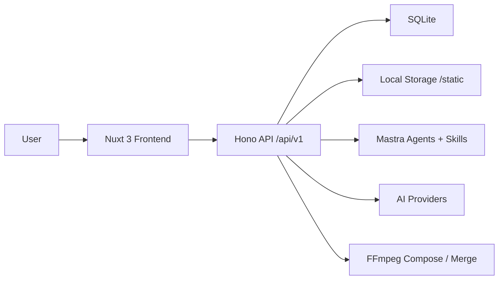

<p align="center">
  
</p>

<h1 align="center">Lovarts Drama / Lovarts短剧</h1>

<p align="center">
  AI-native drama production workspace for scripts, storyboards, assets, video generation and node-based creative canvas.
</p>

<p align="center">
  <a href="https://nodejs.org"></a>
  <a href="https://nuxt.com"></a>
  <a href="https://vuejs.org"></a>
  <a href="https://www.typescriptlang.org"></a>
  <a href="./LICENSE"></a>
</p>

<p align="center">
  <a href="#features">Features</a>
  ·
  <a href="#quick-start">Quick Start</a>
  ·
  <a href="#architecture">Architecture</a>
  ·
  <a href="#configuration">Configuration</a>
  ·
  <a href="#deployment">Deployment</a>
</p>

<p align="center">

  
</p>

## Overview

Lovarts Drama is a full-stack AI drama production platform. It helps teams move from script planning to character and scene assets, storyboard breakdown, image generation, video generation, dubbing, composition, export and canvas-based creative planning.

The project is designed as a practical production workspace rather than a marketing page: compact dark UI, reusable creative input, asset libraries, episode workbench and a full-screen infinite canvas.

## Features

| Area | What it does |
| --- | --- |
| Drama projects | Create drama projects, episodes, scripts and production metadata. |
| Character library | Manage character profile, appearance, reference images, voice style and generated assets. |
| Scene library | Manage locations, time, visual prompts and reusable scene assets. |
| Storyboard workbench | Break scripts into shots, generate first frames, videos, audio, subtitles and composed clips. |
| AI configuration | Configure text, image, video and voice services from the Web settings page. |
| Agent skills | Use built-in skills for rewriting, extraction, storyboard splitting, voice assignment and grid prompt generation. |
| Inspiration page | Browse waterfall materials, app shortcuts and a shared bottom input box. |
| Creation page | Use the same shared creative input in a focused generation workspace. |
| Infinite canvas | Vue Flow based node canvas for text, image, video and workflow orchestration. |

## Screens and Routes

| Route | Purpose |
| --- | --- |
| `/` | Drama project entry |
| `/home` | Inspiration feed and quick creative apps |
| `/generate` | Creation workspace |
| `/canvas` | Full-screen infinite canvas |
| `/settings` | AI service and Agent configuration |
| `/library/characters` | Character library |
| `/library/scenes` | Scene library |
| `/drama/:id` | Drama detail |
| `/drama/:id/episode/:episodeNumber` | Episode production workbench |

## Tech Stack

| Layer | Stack |
| --- | --- |
| Frontend | Nuxt 3, Vue 3, TypeScript, Naive UI, Tailwind CSS, Vue Flow, Pinia |
| Backend | Node.js 20, Hono, Drizzle ORM, better-sqlite3, Mastra, AI SDK |
| Database | SQLite with WAL mode |
| Media | FFmpeg, fluent-ffmpeg, sharp |
| Deployment | Docker, Docker Compose |

## Architecture

```text
.
├── backend/
│   ├── src/index.ts              # Hono app, middleware and route registration
│   ├── src/db/                   # SQLite initialization and Drizzle schema
│   ├── src/routes/               # REST API modules
│   ├── src/services/             # AI generation, storage and media services
│   └── src/services/adapters/    # Provider adapters
├── frontend/
│   ├── app/pages/                # Nuxt routes
│   ├── app/components/           # Shared UI components
│   ├── app/layouts/              # Product shell layouts
│   ├── app/canvas/               # Infinite canvas migration
│   └── app/assets/               # Global product and canvas CSS
├── skills/                       # Agent skill prompt assets
├── configs/                      # Config templates
├── data/                         # Runtime database and static files
├── Dockerfile
└── docker-compose.yml
```



## Quick Start

### Prerequisites

- Node.js 20+
- npm 9+
- FFmpeg 4+

Install FFmpeg:

```bash
# macOS
brew install ffmpeg

# Ubuntu / Debian
sudo apt update
sudo apt install ffmpeg
```

### Install

```bash
git clone https://github.com/ddlmanus/lovarts-drama.git
cd lovarts-drama

cd backend
npm install

cd ../frontend
npm install
```

### Run

Start the backend:

```bash
cd backend
npm run dev
```

Start the frontend:

```bash
cd frontend
npm run dev
```

Open:

```text
Frontend: http://localhost:3013
Backend:  http://localhost:5679
Health:   http://localhost:5679/api/v1/health
```

## Configuration

Copy the config template if you need a local config file:

```bash
cp configs/config.example.yaml configs/config.yaml
```

The current backend primarily reads runtime values from environment variables. AI service credentials are best managed from the Web settings page, which stores them in SQLite instead of source files.

| Variable | Default | Description |
| --- | --- | --- |
| `PORT` | `5679` | Backend HTTP port |
| `DB_PATH` | `data/huobao_drama.db` | SQLite database path |
| `STORAGE_PATH` | `data/static` | Local media storage path |
| `STORAGE_BASE_URL` | empty | Public static file base URL |
| `PUBLIC_URL` | empty | Public site URL |
| `API_PUBLIC_URL` | empty | Public API URL |
| `APIMART_API_KEY` | empty | Apimart API key |
| `AI_API_KEY` | empty | Generic fallback AI key |
| `APIMART_BASE_URL` | built-in default | Apimart base URL |
| `APIMART_TEXT_MODEL` | built-in default | Default text model |
| `APIMART_IMAGE_MODEL` | built-in default | Default image model |
| `APIMART_VIDEO_MODEL` | built-in default | Default video model |

## API Modules

All main API routes are mounted under:

```text
/api/v1
```

| Route | Module |
| --- | --- |
| `/health` | Health check |
| `/dramas` | Drama projects |
| `/episodes` | Episodes |
| `/storyboards` | Storyboards |
| `/characters` | Characters |
| `/scenes` | Scenes |
| `/images` | Image generation |
| `/videos` | Video generation |
| `/upload` | Uploads |
| `/ai-configs` | AI service configs |
| `/ai-providers` | Provider presets |
| `/agent-configs` | Agent configs |
| `/agent` | Agent invocation |
| `/compose` | Single-shot composition |
| `/merge` | Episode merge |
| `/grid` | Grid image generation and split |
| `/skills` | Skill metadata |
| `/ai-voices` | Voice configs |
| `/tasks` | Task status |

Static files:

```text
/static/*
```

Webhook callbacks:

```text
/webhooks
```

## Agent Skills

Runtime skill prompts live in `skills/`.

| Skill | Purpose |
| --- | --- |
| `script_rewriter` | Rewrite source text into drama scripts |
| `extractor` | Extract characters and scenes |
| `storyboard_breaker` | Split scripts into storyboard shots |
| `voice_assigner` | Assign voices to characters |
| `grid_prompt_generator` | Generate character, scene and shot grid prompts |

These Markdown files are runtime prompt assets. Edit them carefully because they directly affect Agent behavior.

## Development Commands

Backend:

```bash
cd backend
npm run dev        # Development server
npm start          # Start API directly
npm run build      # TypeScript build
npm run typecheck  # Type-only check
```

Frontend:

```bash
cd frontend
npm run dev        # Nuxt dev server on 3013
npm run build      # Production build
npm run generate   # Static generation
npm run preview    # Preview build
```

## Deployment

### Docker Compose

```bash
docker compose up -d --build
```

Default service:

```text
http://localhost:5679
```

Runtime data is mounted to:

```text
./data
```

### Manual Production Run

```bash
cd frontend
npm install
npm run generate

cd ../backend
npm install
PORT=5679 npm start
```

The backend serves the generated frontend output from `frontend/dist`.

## Troubleshooting

### Frontend cannot reach backend

Check the backend:

```bash
curl http://localhost:5679/api/v1/health
```

Then verify the proxy in `frontend/nuxt.config.ts`.

### Video composition fails

Check FFmpeg:

```bash
ffmpeg -version
```

Also confirm `data/static` is writable.

### Canvas styles are missing

The canvas page depends on Tailwind and Vue Flow CSS registered in `frontend/nuxt.config.ts`:

```text
~/assets/tailwind.css
@vue-flow/core/dist/style.css
@vue-flow/core/dist/theme-default.css
@vue-flow/minimap/dist/style.css
~/assets/canvas.css
```

### SQLite is locked

The database uses WAL and a busy timeout. If lock errors continue, make sure only one backend process is writing to the same DB file.

## Contributing

Before submitting changes:

```bash
cd frontend && npm run build
cd ../backend && npm run typecheck
```

Do not commit local secrets, generated databases, uploaded media, `node_modules`, `.nuxt`, `.output`, or `dist`.

## License

Released under the [MIT License](./LICENSE).
